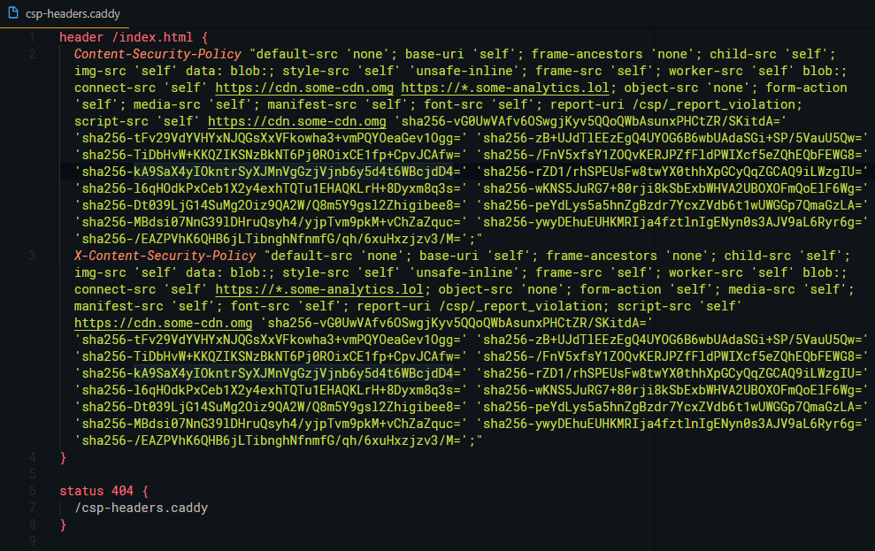

# Caddy CSP Webpack Plugin
Generate [Caddy server header directives](https://caddyserver.com/docs/header) along with your bundle for an always-fresh Content Security Policy using your assets' latest hashes  🔒

&nbsp;


&nbsp;

## Usage

Require the plugin...

````javascript
const caddyCSPPlugin = require('caddy-csp-webpack-plugin');
````

...and include the plugin in your webpack configuration.

````javascript

plugins: [
  new caddyCSPPlugin(),
],
````

## Options

Below are available configuration options, and their default settings.

````javascript

  {
    filename: `csp-headers.caddy`, // generated file name relative to your output path
    headerPath: `/`, // path at which to apply the CSP header(s)
    policies: [], // Array of additional security policies as strings See example below
    include_paths: [], // Include other files not in your bundle
    minify_include_paths: true, // Minify the file's code before hashing the contents
    ie_header: false, // include an additional 'x-content-security-policy' for use with Internet Exploder
    hashFunction: `sha256`, // Hash function used for hashing out content hashes
  }
````

## Example Config

A typical configuration might look like so:

````javascript

  new CaddyCSPPlugin({
    include_paths: [
      `${process.cwd()}/service-worker/minion.js`,
      `${process.cwd()}/static/some-structure-metadata.js`,
    ],
    headerPath: `/index.html`,
    ie_header: true,
    hashFunction: `sha256`,
    policies: [
      `default-src 'none'`,
      `base-uri 'self'`,
      `frame-ancestors 'none'`,
      `child-src 'self'`,
      `img-src 'self' data: blob:`,
      `style-src 'self' 'unsafe-inline'`,
      `frame-src 'self'`,
      `worker-src 'self' blob:`,
      `connect-src 'self' https://*.some-analytics.lol`,
      `object-src 'none'`,
      `form-action 'self'`,
      `media-src 'self'`,
      `manifest-src 'self'`,
      `font-src 'self'`,
      `script-src 'self' https://cdn.some-cdn.omg`,
      `report-uri /csp/_report_violation`,
    ],
  }),

````

**NOTE**: Any `script-src` policy will be identified and have the hashes appended to it.

### Result

When the build is complete, the generated file is emitted with the rest of your bundle. The `/csp-headers.caddy` file generated in the example above looks like so:




Use an [`import`](https://caddyserver.com/docs/import) directive in your [`Caddyfile`](https://caddyserver.com/docs/http-caddyfile), for example, and Caddy serve up your hot new security policy to anyone who comes knocking 😎


## Caveats

### CSS Files

At the moment, this plugin only hashes JavaScript assets.

### Server restart
After uploading your generated header to your server, you'll need to restart your Caddy instance for any changes to take effect.
